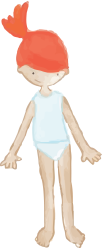

# Final Project Brief and Reflections

:::info
youtube: https://youtu.be/KPcWguFwvCU
github: https://github.com/mal2333/Final-Project
github game.html: https://github.com/mal2333/Final-Project/blob/master/game.html
**Open the `game.html` page for the game**
Index is the general page that is outdated. I created it to understand the layout.
I am sorry, the video is SUPER long!
:::

 

I bit ago I met _Linda Liukas_ the author of "Hello Ruby" a children's coding book. We collaborated on a few projects here in Dubai and I got inspired by her whimsy view on coding. I will create a fun and interactive game highlighting some computational thinking concepts for young children.


# <span style= "color:#ff6a13">Dresscode</span>
Based on the concept of paper dolls, you will help Ruby (book character) go through her wardrobe and help her get dressed. She has a special dress code for each day, there may be many answers...
This game will help children in developping computational concepts in a fun way... we are working here on boolean expressions and selection.

#### Booleans
- On Monday, Ruby wears green AND red clothes
- On Tuesday, Ruby wears clothes with polka dots OR stripes.
- On Wednesday, Ruby doens't wear any blue.
- ...

## Programming Specifications
### HTML
+ Head with al CSS links + Bootstrap for the layout
+ Header
+ Main
    + Column 1: Instructions - prompts + keeping track of results
    + Column 2: Images - for feedback
    + Column 3: 4 carousels - for selection + submit button
+ Footer
```htmlembedded
<html>
<head>
  <title>Hello Ruby</title>
  <meta charset="UTF-8">
  <!--CSS LINKS-->
</head>

<body class="container-sm">
  <header><!--image--></header>
  <main class="row p-5">
    <div class="col-3"><!--column 1-->
      <div class="instructions"><!--prompts--></div>
    </div>
    <div class="col-2"><!--column 2-->
      
      <div id="ruby-clothes-top"><!--js generated images--></div>
      <div id="ruby-clothes-bottom"><!--js generated images--></div>
      <div id="ruby-clothes-shoes"><!--js generated images--></div>
     <div id="ruby-clothes-accessories"><!--js generated images--></div>
    </div>
    <div class="col-7 text-center"><!--column 3-->
      <section class="tops slider"><!--js generated carousel--></section>
      <section class="bottoms slider"><!--js generated carousel--></section>
      <section class="shoes slider"><!--js generated carousel--></section>
      <section class="accessories slider"><!--js generated carousel--></section>
      <form><button>SuBMit</button></form>
    </div>
    </div>
  </main>
  <footer>
    <div class="row yellow-div"></div>
    <div class="row grey-div"></div>
  </footer>

</body>
</html>
```

### CSS

```htmlmixed
<!--Bootstrap--><link rel="stylesheet" href="https://stackpath.bootstrapcdn.com/bootstrap/4.3.1/css/bootstrap.min.css" integrity="sha384-ggOyR0iXCbMQv3Xipma34MD+dH/1fQ784/j6cY/iJTQUOhcWr7x9JvoRxT2MZw1T" crossorigin="anonymous">
<!--CSS styles--><link rel="stylesheet" type="text/css" href="css/styles.css">
<!--Slick--><link rel="stylesheet" type="text/css" href="slick-all/slick/slick.css">
<!--Slick--><link rel="stylesheet" type="text/css" href="slick-all/slick/slick-theme.css">
<!--Google Fonts--><link href="https://fonts.googleapis.com/css2?family=Rubik:wght@300&display=swap" rel="stylesheet">
```

### JS
```htmlmixed
  <!--jQuery--><script type="text/javascript" src="https://code.jquery.com/jquery-2.2.0.min.js"></script>
  <!--slick js--><script type="text/javascript" src="slick-all/slick/slick.js" charset="utf-8"></script>
  <!--script js--><script type="text/javascript" src="js/script.js"></script>
```

#### Arrays of objects
+ For the tops, bottoms, shoes, and accessories
    + type: `'.tops'`, `'.bottoms'`, `'.accessories'`, `'.shoes'`.
    + colors: `['white', 'green', 'red']`
    + characteristics: `['white', 'green', 'hat']`
    + source: `'`
```javascript
var arrayTops = [//array of Tops
  {type: '.tops', colors:[], characteristics:[], source:''},
  {type: '.tops', colors:['white'], characteristics: ['short','shirt'], source:''}
  //... more entries
];
```
+ For the prompts
    + Promtps: `'On Monday, Ruby wears...'`
    + Answers: `['green', 'red']`
    + Condition: `'and'`, `'or'`, `'nor'`, `'not'`
```javascript
var prompts = [//array of prompts
  {prompt: 'On Monday,<br><br>Ruby wears <br><span style="color:red">red</span> <b>AND</b> <span style="color:green">green</span>.<br>', answers: ['red', 'green'], condition: "and"},
  //ideally it would be generated
];
```

#### Functions
##### `populate(array, type)`
+ `FOR` each object in the arrays (arrayTops, arrayBottoms, arrayShoes, arrayAccessories)
+ Run the following function :
```javascript
$.each(array[i], function(index, value) {
  if (`${index}`== 'source'{//if the index matches `source`
        $(type).append('<div>'+`${value}`+'</div>');//append the value of that index (the image source) to the element of type
  }
});
```
##### `on('ready')`
+ populate all of the carousels using the `populate` function
+ call `.slick` to create the carousels one for `.tops`, one for `.bottoms`, `.shoes`, `.accessories`

```javascript
$(document).on('ready', function() {
  populate(arrayTops, '.tops');
  populate(arrayBottoms, '.bottoms');
  populate(arrayShoes, '.shoes');
  populate(arrayAccessories, '.accessories');

  $(".tops").slick({
    dots: true,
    infinite: true,
    centerMode: true,
    slidesToShow: 3,
    draggable: true,
    focusOnSelect: true
  });
```
+ For each array, get the `source` (the image src) of the first element `[0]`, and append it in the middle column - to create the clothes selection preview
```javascript
  $.each(arrayTops[0], function(index, value) {
    if (`${index}`== 'source'){
      $('#ruby-clothes-top').append(`${value}`);
      $('#top').css("width","170px");
    }
  });
```
##### Variables
Initialize all of the variables used in the whole program
```javascript
var currentSlideTops = 0;
var currentSlideBottoms = 0;
var currentSlideShoes = 0;
var currentSlideAccessories = 0;
var counter=0;
var wrongCounter=0;
```
##### `on('beforeChange', function())`
+ For each element, get a `currentSlide` to know which slide has been selected.
+ `empty` the middle column (undress Ruby)
+ `append` the image from the new slide (getting the source from the array)
+ add a `css` element to the image (to fit Ruby)
```javascript
$('.tops').on('beforeChange', function(event, slick, currentSlide, nextSlide){
    currentSlideTops = nextSlide;
    $('#ruby-clothes-top').empty();
    $.each(arrayTops[currentSlideTops], function(index, value) {
      if (`${index}`== 'source'){
        $('#ruby-clothes-top').append(`${value}`);
        $('#top').css("height","170px");
      }
    });
});
```
##### `on('click', function())`
+ From the selected slides, get all of the colors into 1 array, then all of the characteristics into 1 array, and add them together in one array `arrayClothes`
```javascript
$("button").on("click",function(){
  var arrayColors = [];
  var arrayCharacteristics = [];
  var arrayClothes = [];
  arrayColors.push(...arrayTops[currentSlideTops].colors, ...arrayShoes[currentSlideShoes].colors, ...arrayBottoms[currentSlideBottoms].colors, ...arrayAccessories[currentSlideAccessories].colors);
  arrayCharacteristics.push(...arrayTops[currentSlideTops].characteristics, ...arrayShoes[currentSlideShoes].characteristics, ...arrayBottoms[currentSlideBottoms].characteristics, ...arrayAccessories[currentSlideAccessories].characteristics);
  arrayClothes.push(...arrayColors, ...arrayCharacteristics);
```
+ `IF` the prompt's condition is `AND`
+ `ELSE IF` the prompt's condition is `OR`
+ `ELSE IF` the prompt's condition is `NOT`
+ `ELSE IF` the prompt's condition is `NOR`
```javascript
  if (prompts[counter].condition==="and"){...
  }else if(prompts[counter].condition==="or"){...
  }else if(prompts[counter].condition==="not"){...
  }else if(prompts[counter].condition==="nor"){...
  }
```
+ Inside `AND` check that `prompt.answer[0]` AND `prompt.answer[1]` are found in `arrayClothes`
```javascript
if (($.inArray(prompts[counter].answers[0], arrayClothes) >= 0)&&($.inArray(prompts[counter].answers[1], arrayClothes) >= 0)){...}
```
+ Inside `OR` check that `prompt.answer[0]` OR `prompt.answer[1]` are found in `arrayClothes`
```javascript
if (($.inArray(prompts[counter].answers[0], arrayClothes) >= 0)||($.inArray(prompts[counter].answers[1], arrayClothes) >= 0)){...}
```
+ Inside `NOT` check that `prompt.answer[0]` is NOT found in `arrayClothes`
```javascript
if (jQuery.inArray(prompts[counter].answers[0], arrayClothes) < 0){...}
```
+ Inside `NOR` check that `prompt.answer[0]` OR `prompt.answer[1]` are found in `arrayClothes`
```javascript
if ((jQuery.inArray(prompts[counter].answers[0], arrayClothes) < 0)&&(jQuery.inArray(prompts[counter].answers[1], arrayClothes) < 0)){....}
```

+ Inside each condition above:
1. If we get the right:
    + wrongCounter is 0
    + append the reward (gem image)
    + empty the prompt
    + append the new prompt
    + add 1 to counter
```javascript
wrongCounter=0;
$('.instructions').append('');
$('.questions').empty();
$('.questions').append(prompts[counter+1].prompt);
counter++;
```
2. If we got it wrong:
    + append the wrong image (cross image)
    + add 1 to wroung counter
```javascript
$('.questions').append('');
wrongCounter++;
    }
```
+ Check the counters
    + If `wrongCounter` reaches 4, remove all of the crosses and move on to the next question
    + If `counter` reaches 7, the end of our promts (for now), remove all the instructions and reinitialize the counter
```javascript
if(wrongCounter==4){
  wrongCounter=0;
  $('.questions').empty();
  $('.questions').append(prompts[counter+1].prompt);
  counter++;
}
if(counter==7){
  $('.instructions').append('<br>');
  counter=0;
}
```


## Debugger and console
I regularily used debugger and the `alert()` function. It helped me understand:
+ my layout and margins
+ the currentSlide numbers there were generated from `slick`
+ how my arrays were constructed, and what data I was putting together
+ making sure I was accessing the source element when generating my carousels
+ Looking at the way I was generating `<div>` with JS for the images and the carousels as they weren't lining up and it is very clear when you see them being added to the HTML as your run the phe phe p

:::info
I had a harder time with debugger for this project as I am using jQuery and Slick, which makes it tricky to see every steps as it uses someone else's functions. It is not as transparent as I expected.
:::

## Reflection video
+ Main features of the application
    + Carousels
    + Accessing arrays of objects to generate the slides for the carousel
    + Accessins all of the data from the arrays to generate new arrays and comparing their data.
    + Checkin which slide is currently selected, finding the source of that index in the array and appending the image in the HTML
    + Counting results, wrong results and prompts
+ Explain interesting bits/challenging bits of features
    + Understanding how to access things within my arrays with jQuery
    + Having to understand someone else's functions when using a new library, and reading through the API
+ Reflect on the program
    + It's a work in progress and far from done
    + The concept works, but nothing really lines up. Those are more graphic issues, and I just didn't hve time to modify all of the pictures on illustrator. It's interesting that graphics and code have to align in a way. The graphics side has to understand how it will be coded to provide appropriate files.
